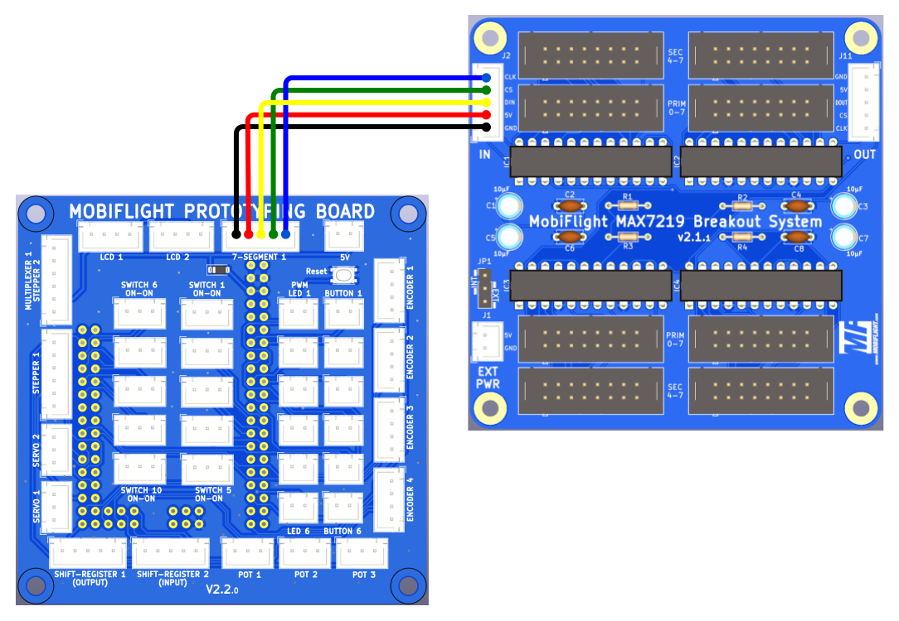

# MobiFlight MAX7219 Breakout System
The MobiFlight MAX7219 Breakout System is a 80x80mm module with 4 driver chips, capable of driving 8 digits each.

These chips are already connected in a daisy chain on the PCB, creating a chain of 4, together capable of driving 32 digits. Since MobiFlight allows up to 8 MAX chips in a single daisy chain, a second module can be connected through the OUT connector (J11). With two boards connected, the daisy chain will consist of all 8 MAX chips, for a total capability of 64 digits.

The possible second module can be mounted with M3 spacers on top of the first, or also in a different location if a longer JST-XH cable is used, but longer cables can always pick up more interference from other elecronics, and the MAX7219 are quite sensitive to electrical noise in the signals.

Since an Arduino Mega Module can control up to 4 separate MAX daisy chains, up to 4 x 64, i.e. 256 digits, are possible per Mobiflight board (e.g., [the MEGA Pro Mini](https://shop.mobiflight.com/product/arduino-mega-2560-pro-mini)).

The daisy chained chips are laid out in order from top left to bottom right:

```
1 2
3 4
```

## Connectors
There are two flat cable connectors (straight IDC type) assigned to each MAX chip for more flexibility and efficient use.

 

The flat cable connectors have a _primary connector_ (PRIM 0-7) and a _secondary connector_ (SEC 4-7) that allows splitting the digits between two digit boards. Please note that the digits are numbered starting from zero, from right to left, like this:

```
PRIM: 7 6 5 4 3 2 1 0
SEC:  7 6 5 4
```

#### A few examples:

Having two connectors allows for the possibility of dividing the 8 digits of a MAX chip between two groups of digts:
* 2 x 4 digits, 
* 1 x 3 and 1 x 5 digits (5 on primary, 3 on secondary)
* 1 x 6 digits (using only primary connector), and 
* 2 x 3 digits. 

Not all 8 digits of a MAX chip have to be used. Also, the digits do not have to be distributed evenly across the MAX chips.

If, for example, 6 digits are plugged into `PRIM 0-7`, digits 0-5 are occupied. This means that digits 6 and 7 on connector J3 would remain unused. The [compatible digit pcb's](https://shop.mobiflight.com/product/max7219-digit-pcb-system-50cm) exist in 3, 4, 5 and 6 digit versions, as those are the most common use cases in most cockpits.

This applies to connectors next to each of the remaining 3 MAX7129 chips in the same way.

Displays with 3, 4, 5 and 6 digits can be plugged into the _PRIM (0-7)_ connector. Displays with 3 or 4 digits can be plugged into _SEC (4-7)_ connector, but not more than 8 digits in total. A combination of 5 or 6 digits and 4 digits at the same time is therefore not possible, as the digits would overlap in the middle.

## Prototyping board

With the 5-pin XH JST cable that is provided, the connection is easy, connect the `7-SEGMENT-1` connector of the Prototyping board to J2 `IN` connector on the MAX7219 breakout board. IF you use a pre-made 5 pin JST-XH cable other than the one that was included with the module, pay attention to the connector orientation, so that the wires connect to the same pins on both connector.

> [!NOTE]
> Starting with v2.0, the pin sequence is the same for both boards, the prototyping board and the MAX7219 breakout board.

## Daisy chain mode


You can connect two boards together and take advantage of the daisy chain capability. Two boards is the maximum, only up to 8 MAX7219 chips can be chained. This is a limitation of the MAX7219 chip itself.

## External Power supply
If you chain two modules, or if you encounter problems with the stability of the digits in use, you should first ensure that you are using a direct USB connection to the back of your computer, or via a good quality powered usb hub. Unpowered hubs are sharing the 500mA of the PC usb port with all connected devices, and they are not reliable for connecting MobiFlight boards. A powered hub with guaranteed 500mA per port is needed. If you encounter stability issues in use, and especially if you chain two breakout boards together, you should use external power. Use a good quality, regulated 5V power supply and connect it to the `EXT PWR` connector on the board.

> [!NOTE]
> When using external power, set the blue jumper to the "EXT" position, otherwise use "INT" position.

## Board overview
 

### MAX7219 - IC1-4
The IC socket and the 4 MAX7219 chips, ordered from top left to bottom right.

### Digit module connectors - `PRIM 0-7` and `SEC 4-7`
The connectors to connect the flat ribbon cables, 2 per MAX chip.

### IN-connectors (J2)
The pins that are connected to pins on the MobiFlight board.

* Pin 1 - VCC
* Pin 2 - GND
* Pin 3 - DIN
* Pin 4 - CS
* PIN 5 - CLK

### OUT-connector (J11)
* Pin 1 - VCC
* Pin 2 - GND
* Pin 3 - DOUT
* Pin 4 - CS
* PIN 5 - CLK

## Assembly instructions
1. Solder resistors (10kOhm) to the top of the PCB
1. Solder the capacitors (100nF) to the top of the PCB. Be careful, both the resistor (R10k) and the capacitor (C) markings do look fairly simular on the board!
1. Solder the Max7219 IC sockets to the top of the PCB, make sure the small notch on one end align with the marking on the PCB footprint, so they are oriented correctly.
1. Solder the XH JST connectors to the top of the PCB, pay attention to the orientation of the cutouts on the connector frame
1. Solder the 8x2 flat cable connectors to the top of the PCB, also orient the cutout on the connector with the PCB footprint.
1. Insert the MAX7219 Chips into the sockets, watch out for correct orientation marked by the notch.

## MobiFlight Configuration
### Device configuration
See [general documentation for more information](https://docs.mobiflight.com/devices/seven-segment-display/configuring-output/) on how to configure the 7-segment displays.

### Output config

#### Special feature with 3 digit displays
A special feature is the 3 digit displays. If 2 x 3 digits are used on connectors J2 and J3 in MobiFlight, care must be taken to ensure that they are each offset by one digit. A 3-digit display on J2 would therefore occupy digits 1, 2 and 3 in MobiFlight and on J3 digits 5, 6 and 7 in MobiFlight.

Normally, assignment of the 3 digit displays in MobiFlight when 3 digit displays are used looks like this:


With the breakout board, using two 3-digit displays looks like this:


This also applies if 5 digits are assigned to J2, then only 3 digits can be assigned to J3. But since digit 4 is parallel on J2 and J3, it is imperative to start with digit 5 on J3 for a 3-digit display (digit 5, 6 and 7). Nothing has to be taken into account when wiring, because the 3-digit PCBs already take this into account, regardless of whether they are plugged into J2 or J3.

This may look confusing at first glance, but once you look at the constellation, it quickly becomes clear that this is the only way to ensure optimum utilization without having to plug in jumpers or the like.

## Additional information

### Orientation and pin assignments


The soldering points, which are square, always designate pin 1 of the corresponding component.
After pin 1, the row continues in ascending order with pins 3, 5, 7, 9, 11, 13 and 15. The other row therefore has pins 2, 4, 6, 8, 10, 12, 14 and 16.

With the connectors J2, J4, J6 and J8 the cathodes of the displays are connected in ascending order from pin 2. So pin 2 = cathode of digit 0, pin 4 = cathode of digit 1, pin 6 = cathode 3, pin 8 = cathode 4, pin 10 = cathode 5 and pin 12 = cathode 6. Pins 14 and 16 are on the connectors always free with an even pin number.

The segments were connected to the odd pins. Pin 1 = Segment A, Pin 3 = Segment B, Pin 5 = Segment C, Pin 7 = Segment D, Pin 9 = Segment E, Pin 11 = Segment F, Pin 13 = Segment G and Pin 15 of the DP.

The situation is similar for connectors J3, J5, J7 and J9.
Pin 2 = cathode 4, pin 4 = cathode 5, pin 6 = cathode 6 and pin 8 = cathode 7. Pins 10, 12, 14 and 16 are not used.
In the case of the segments, these are assigned even numbers, as is the case with the plugs.


### Top side with components


### Bottom side


### Schematic

