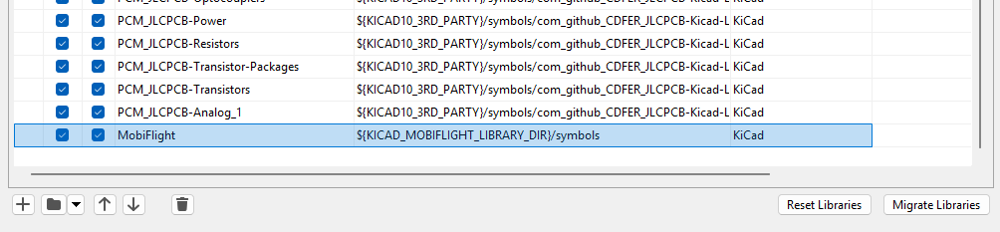

# MobiFlight Library
To use this library, create a new environment variable "KICAD_MOBIFLIGHT_LIBRARY_DIR" within KiCad and set the path to this folder.

# Symbols
Open the Symbol-Editor and add a Symbol Library folder (press the down-arrow next to the folder icon) and choose *KiCad (Folder with .kicad_sym files)*, name this library `MobiFlight` and navigate to the folder `mobiflight-pcbs/mobiflight-library/symbols`.

# Footprints

Open the Footprint-Editor and add a Footprint Library, name this library `MobiFlight` and navigate to the folder `mobiflight-pcbs/mobiflight-library/footprints`.

