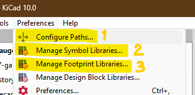
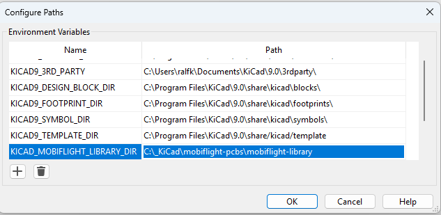
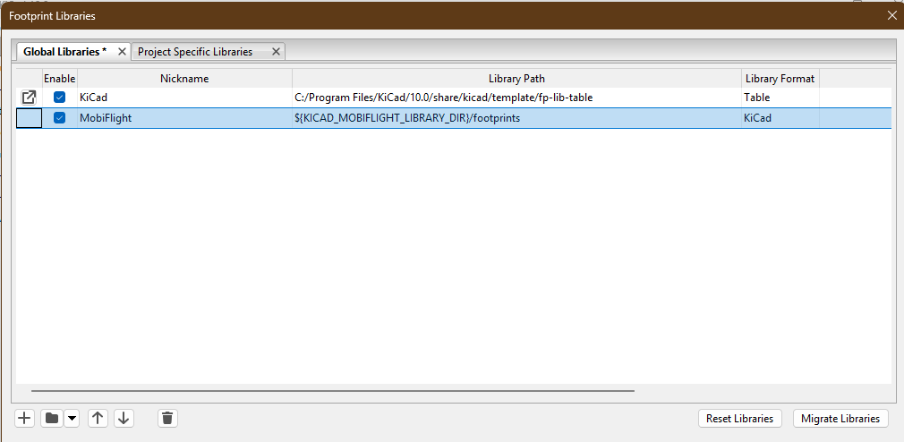

# MobiFlight Library
This library contains some symbols and footprints used by the PCB designs in the mobiflight-pcbs repository. It requires [KiCad](https://www.kicad.org/) version 10 or later.

To use this library, it needs to be added to your KiCad library tables.

### 1. Add the path variable

Create a new environment variable "KICAD_MOBIFLIGHT_LIBRARY_DIR" within KiCad and set the path to this folder.

### 2. Symbols
Add a Symbol Library folder (press the down-arrow next to the folder icon) and choose *KiCad (Folder with .kicad_sym files)*, navigate to the folder `mobiflight-library/symbols`, and name this symbol library `MobiFlight`.

### 3. Footprints

Finally, add a Footprint Library folder (press again the down-arrow next to the folder) and choose "KiCad (Folder with .kicad_mod files)", navigate to the folder `mobiflight-library/footprints`, and name this footprint library `MobiFlight`.

You should now see the MobiFlight library in your KiCad projects.