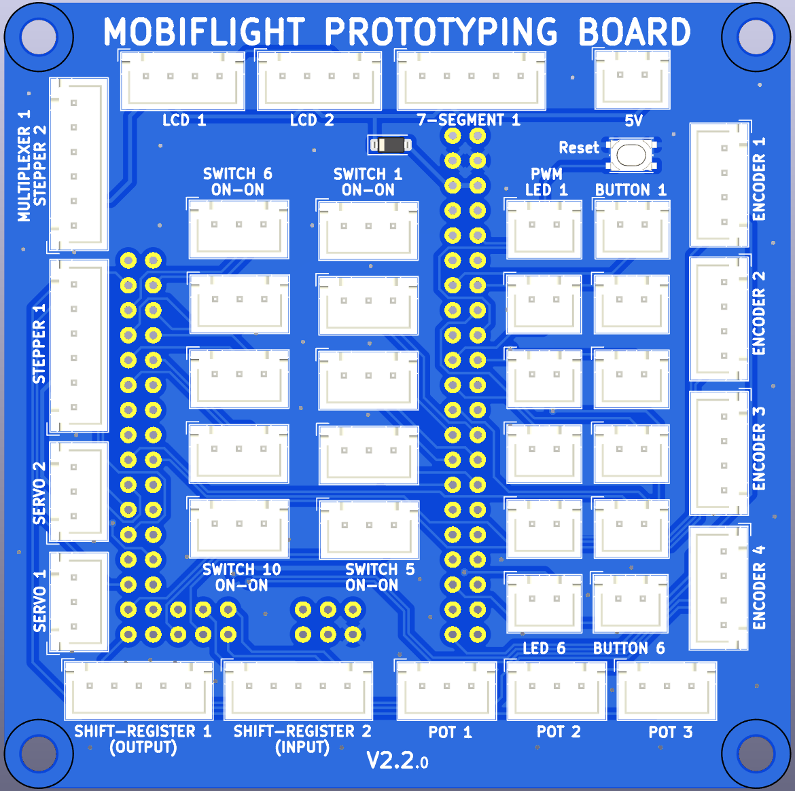
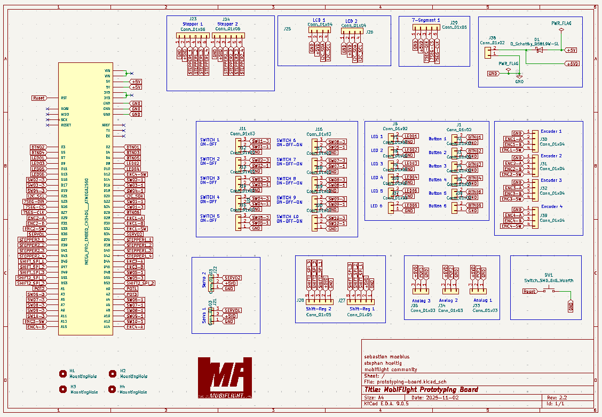
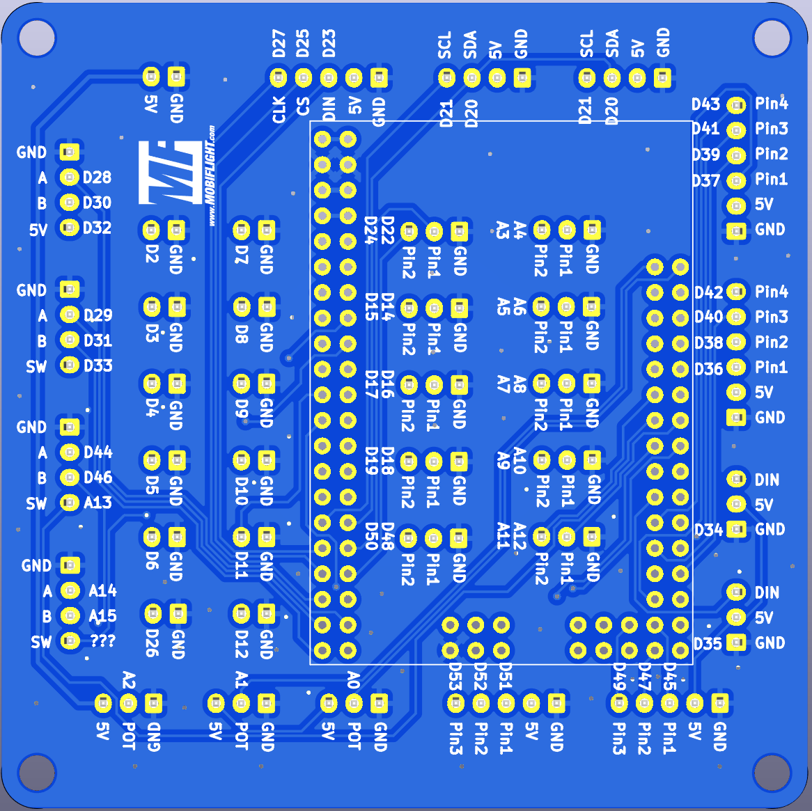

# MobiFlight Prototyping Board
The MobiFlight Prototyping Board is a breakout board to learn and experiment with the different input and output devices that are supported by MobiFlight.
The board uses XH JST connectors of different sizes depending on the type of device. These connectors ensure a secure connection and correct orientation of the plugs.

The MobiFlight Prototyping Board is compatible with Arduino Mega 2560 Pro Mini that is attached to the back of the board.

There are two configurations available (latest v2.1):
* Standard - [prototyping-board.mfmc](prototyping-board.mfmc)

  All buttons from `Button 01` to `Button-06` are available, and `Stepper 1` and `Stepper 2` can be both used for steppers 
* Multiplexer - [prototyping-board.multiplexer.mfmc](prototyping-board.multiplexer.mfmc)

  using Stepper 2 as Multiplexer 1 connection, and Button 1 and Button 2 for the signal channels. See [Multiplexer Breakout Board](../breakout-multiplexer/README.md) for more information.

The board is updated based on user feedback, please see the section [older versions](#older-versions) of the config file.
## Devices overview

### Button 1 - 6
Simple buttons that connect with just two wires.

Left pin is Ground, right pin is VCC.

**IMPORTANT** Button 6 is shared with 4th Encoder Push Button

### LEDs 1 - 6
All LEDs are using PWM enabled pins and can be dimmed in MobiFlight.
It is recommended to add an apropriate resistor for you LED. 
[More information about LED output devices](https://docs.mobiflight.com/devices/led/).

Left pin is Ground, right pin is VCC.

### Switch 1 - 5 (On-On)
Connector is designed for On-On switches, two or three position switches.
[More information about buttons and switches](https://docs.mobiflight.com/devices/button-switch/).

* Left pin is GND
* middle pin is Button 1 
* right pin is Button 2

### Switch 6 - 10 (On-On)
Connector is designed for On-On switches, two or three position switches.
[More information about buttons and switches](https://docs.mobiflight.com/devices/button-switch/).

* left pin is GND,
* middle pin is Button 1, 
* right pin is Button 2.

### 7-Segment 1
Connect a 7219MAX-chip based board to this pin.
[More information about 7-segment displays](https://docs.mobiflight.com/devices/seven-segment-display/).

* 1st pin GND,
* 2nd pin VCC,
* 3rd pin DIN,
* 4th pin CS,
* 5th pin CLK

### Encoder 1-4
Connect a Encoder with Push Button function.
[More information about rotary encoders](https://docs.mobiflight.com/devices/encoder/).

* 1st pin GND
* 2nd pin Left Pin (A)
* 3rd pin Right Pin (B)
* 4th pin Push Button

**IMPORTANT** 4th Encoder Push Button is shared with Button 6

### Pot 1 - 3
Connect a Potentiometer or other analog input device.
[More information about potentiometers](https://docs.mobiflight.com/devices/potentiometer/).

* 1st pin GND
* 2nd pin Signal
* 3rd pin VCC

### Shift-Register 1-2
Connect an output shift register.
[More information about output shift registers](https://docs.mobiflight.com/devices/output-shift-register/).

* 1st pin GND
* 2nd pin VCC
* 3rd pin SPI (Latch)
* 4th pin SPI (Clock)
* 5th pin SPI (Data)

### Servo 1-2
Connect a servo. [More information about servos](https://docs.mobiflight.com/devices/servo/).

* 1st pin GND 
* 2nd pin VCC
* 3rd pin DIN

### Stepper 1-2
Connect a stepper. [More information about stepper motors](https://docs.mobiflight.com/devices/stepper-motor/).

* 1st pin GND
* 2nd pin VCC
* 3rd pin Pin1 
* 4th pin Pin2
* 5th pin Pin3
* 6th pin Pin4

Use an additional button pin for the Auto-Zero function.

### LCD Display 1-2
Connect a LCD Display. [More information about LCD displays](https://docs.mobiflight.com/devices/lcd/).

* 1st pin GND
* 2nd pin VCC
* 3rd pin I2C - SDA
* 4th pin I2C - SCL

## Schematic

## Bottom side

## Older versions
For older versions please use the following files:
* 2.0 - [prototyping-board-2.0.mfmc](prototyping-board-2.0.mfmc)

