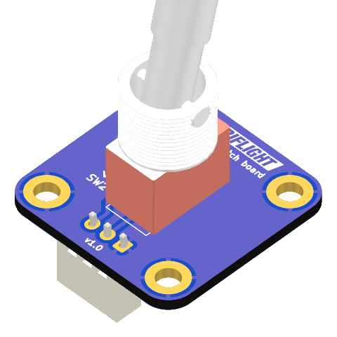

# Toggle switch connection kit

The toggle switch board fits the same form factor and 20x20mm mounting hole pattern as the popular dual encoder board. While the switch itself has threads for panel mounting, this board enables you to mount the switch on a structure behind, allowing a cleaner look for the front panel.

This board features a soldering footprint for the popular ["small body, large lever" metal toggle switch](https://shop.mobiflight.com/product/toggle-switch-12mm-panel-mount/), and a three pin JST-XH connector to fit the [MobiFlight prototyping board](https://shop.mobiflight.com/product/prototyping-board-v2/) switch connector, with distinct signal for up and down position, so it will also work with the three-position switch variants (on-off-on).

This repository contains the KiCad project files. If you are interested in this board, you can also find it in the [MobiFlight Community Shop](https://shop.mobiflight.com/product/toggle-switch-bundle). Ordering from the shop helps us sustain and make MobiFlight even better.

Designed by Tuomas Kuosmanen, April 2026.
